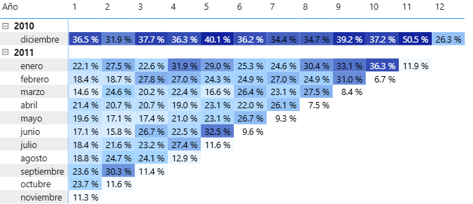
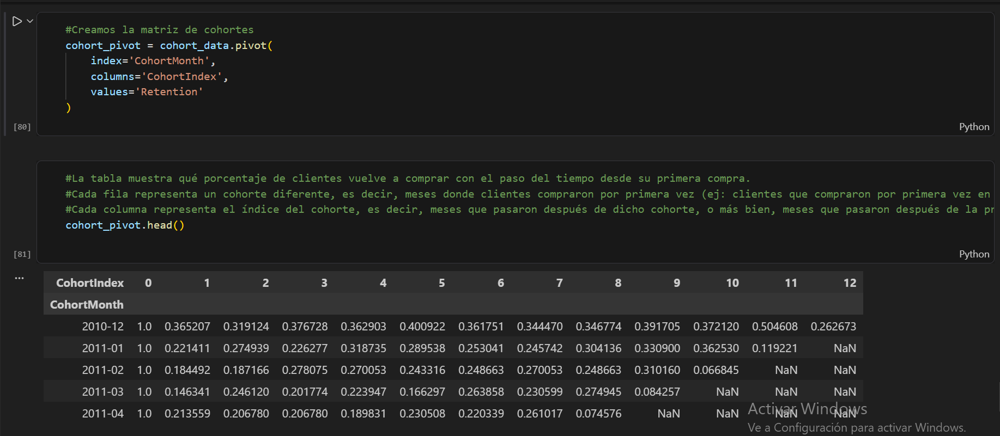

# Customer Retention Cohort Analysis

This project focuses on building a customer retention cohort analysis from scratch using Python.

Rather than starting from a dashboard, the analysis was developed step by step, beginning with raw transactional data and ending with a structured cohort matrix.

---

## Objective

The goal of this project is to understand how customer retention evolves over time by grouping users into cohorts based on their first purchase.

---

## Methodology

### Data Cleaning
- Removed customers without ID  
- Filtered out canceled transactions  
- Handled duplicates and invalid values  
- Applied outlier treatment using percentiles (P99)  

### Data Preparation
- Converted data types (dates and IDs)  
- Created time-based features (monthly cohorts)  
- Assigned each customer to a cohort based on their first purchase  

### Cohort Construction
- Calculated the cohort index (time since first purchase)  
- Aggregated unique customers per cohort and period  
- Computed retention rates  
- Structured the cohort matrix  

---

## Cohort Retention Matrix

The following visualization shows how retention evolves across different cohorts over time:

  

---

## Process Snapshot (Python)

The cohort matrix was built directly in Python. Below is a snapshot of the transformation process:

  

---

## Repository Structure

customer-retention-cohort-analysis
│
├── Proyecto 4.ipynb
├── images
│ ├── heatmap.png
│ └── notebook.png
└── README.md

---

## Key Insights

- Customer retention drops significantly after the first period  
- A smaller group of users remains active over time  
- Cohort behavior varies, suggesting differences in acquisition or engagement  

---

## Conclusion

This project highlights the importance of building analytical logic directly from the data layer. Proper cohort definition and data preparation are essential to ensure that retention metrics are accurate and meaningful.

---

## Contact

Feel free to connect on LinkedIn for feedback or discussion.
